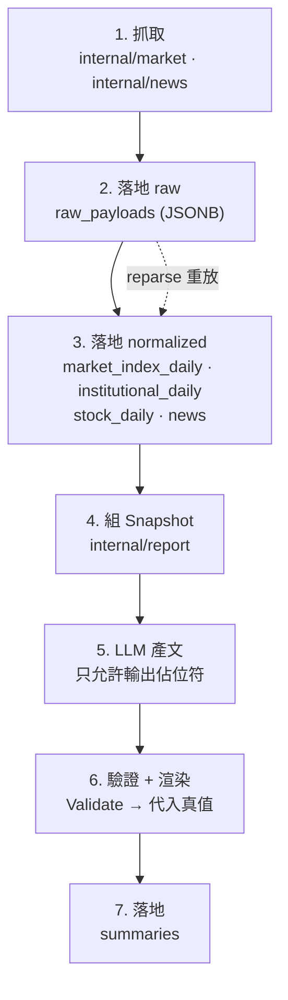

# Phase 1 — 盤後白話摘要 MVP 完成報告

> 自動資料管線（TWSE 行情／三大法人／個股日K／新聞 RSS → Postgres）+ 模板代入防幻覺的 LLM 白話摘要 + 輸出忠實度 eval harness。本階段**不產生任何買賣訊號**。
>
> 本報告是 **Phase 1 交付當下（commit `34a453a`）的凍結快照**，下方統計數字不隨後續 phase 更新。現況請看 [`../ARCHITECTURE.md`](../ARCHITECTURE.md) §6 完成度與 [`phase-1.5.md`](phase-1.5.md) §6 里程碑。

| 指標 | 數字 |
| --- | --- |
| CLI 子指令 | 7 |
| 資料表 | 8 |
| eval golden case | 20 |
| 術語辭典詞彙 | 12 |
| LLM provider | 3 |
| Go 行數 | 2,689 |

---

## 一、已完成功能

| 功能 | 實作位置 | 說明 | 狀態 |
| --- | --- | --- | --- |
| Postgres + 自動 migration | `store.New` → `goose.Up` | migrations 以 `go:embed` 打包進 binary，任何指令啟動時自動建表，無須手動 migrate | ✅ 完成 |
| 抓大盤成交資訊 | TWSE OpenAPI `FMTQIK` | 回傳**整月**每日資料 → 漏抓幾天會自動補回 | ✅ 完成 |
| 抓三大法人買賣超 | TWSE OpenAPI `BFI82U` | 全市場總額（外資／投信／自營商），無個股層級 | ✅ 完成 |
| 抓全市場個股日K | TWSE OpenAPI `STOCK_DAY_ALL` | 只回當日，一次全市場 1000+ 檔 | ✅ 完成 |
| 個股歷史回補 | RWD `STOCK_DAY`，按月分頁 | `backfill --symbol 2330 --from 2026-05` | ✅ 完成 |
| 財金新聞抓取 | RSS（預設自由時報財經） | `url` 唯一鍵去重；`ExtractSymbols` 抽「台積電(2330)」括號代號 | ✅ 完成 |
| raw + normalized 雙層 | `raw_payloads` 表 | 原始 payload 全存 → `reparse` 可重放解析，解析 bug 修完不用重爬 | ✅ 完成 |
| 冪等寫入 | 全部 `ON CONFLICT DO UPDATE` | 同日重跑任意次結果相同——排程重試與手動補抓都安全 | ✅ 完成 |
| LLM 白話摘要 | `report.Generate` | 模板代入：LLM 只准輸出 `{欄位}` 佔位符，**一個數字都不准寫** | ✅ 完成 |
| Provider 可切換 | `llm.Provider` 介面 | Anthropic ／ Gemini ／ Ollama；Gemini 與 Ollama 共用 OpenAI-compat adapter | ✅ 完成 |
| 術語辭典 | `glossary/terms.yaml` | 12 詞（DoD 要求 ≥ 10） | ✅ 完成 |
| eval harness | `eval/cases.yaml` | 20 組 golden case，結果落 `eval_runs` / `eval_case_results` | ✅ 完成 |
| 長駐排程器 | `robfig/cron`（Asia/Taipei） | 平日 17:30 ingest（重試 3 次／間隔 10 分）、18:30 summary、每 30 分 news；每個 job 包 redis 分散式鎖 | ✅ 完成 |
| 出站速率限制 | rediskit `RateLimiter` | Redis 未設定時降為 no-op（啟動時 log 提示） | ✅ 完成 |

---

## 二、資料流



1. **抓取** · `internal/market` / `internal/news`
   TWSE OpenAPI 與 RSS。回傳「解析後結構 + 原始 `json.RawMessage`」兩份。

2. **落地 raw** · `raw_payloads`
   原始 payload 進 JSONB，唯一鍵 `(source, endpoint, trade_date)`。這是 `reparse` 能重放的原因。

3. **落地 normalized** · `market_index_daily` / `institutional_daily` / `stock_daily` / `news`
   全部 upsert。查詢端一律讀這裡，不碰爬蟲。

4. **組 Snapshot** · `internal/report`
   從 pg 讀當日大盤與三大法人 → `report.Snapshot` → `Fields()` 產出「欄位名 → 真值」對照表。

5. **LLM 產文（只有佔位符）**
   prompt 明令「輸出中不可出現任何阿拉伯數字」，只能用 `{欄位名}` 引用。

6. **驗證 + 渲染**
   `Validate` 檢查佔位符 ∈ 允許欄位集，非法即 reject；通過後程式把真值代入 → 數字永遠是真的。

7. **落地** · `summaries`
   唯一鍵 `(trade_date, provider, model)`，同時是 eval 的素材庫與 Phase 4 前端的資料來源。

> **這個設計的重點**
> **數字錯誤被結構性消滅**，而不是靠 prompt 拜託 LLM 不要寫錯。LLM 想寫錯數字都做不到——它根本沒有輸出數字的權限。剩下的風險只有兩類：方向曲解（買超被說成賣壓）與紀律違規（出現建議性字眼），這兩類交給 eval 把關。

---

## 三、資料表

| 表 | 用途 | 冪等鍵 |
| --- | --- | --- |
| `raw_payloads` | 原始 API 回應（審計 + 重解析） | `(source, endpoint, trade_date)` |
| `market_index_daily` | 大盤指數／成交量值 | `trade_date` |
| `institutional_daily` | 三大法人買賣超（全市場總額） | `(trade_date, actor)` |
| `stock_daily` | 個股日K（全市場） | `(symbol, trade_date)` |
| `news` | 財金新聞 | `url` |
| `summaries` | LLM 摘要產出 | `(trade_date, provider, model)` |
| `eval_runs` | eval 執行紀錄與 pass rate | — |
| `eval_case_results` | 逐案結果（FK → `eval_runs`） | — |

`CREATE EXTENSION vector` 已在 `001_init.sql` 開啟——Phase 3 加向量欄位時零遷移。

---

## 四、CLI 指令

| 指令 | 作用 |
| --- | --- |
| `daily-stock schedule` | 長駐排程（平日 17:30 抓資料、18:30 生成摘要、每 30 分抓新聞） |
| `daily-stock ingest` | 手動抓當日市場資料 |
| `daily-stock news` | 手動抓一輪新聞 |
| `daily-stock backfill --symbol 2330 --from 2026-01 [--to 2026-06]` | 回補個股歷史（按月分頁） |
| `daily-stock summary [--date 2026-08-07]` | 生成／重生成某日摘要（預設 DB 內最新交易日） |
| `daily-stock eval` | 跑 golden set，結果落 `eval_runs` |
| `daily-stock reparse` | 重放 `raw_payloads`（解析修復後用，不重爬） |

---

## 五、怎麼測試

### 1. 單元測試（不需要 DB 或 API key）

```bash
go test ./...
```

目前 `eval` / `market` / `news` / `report` 四包通過。`market` 的測試特別涵蓋民國年日期解析與非交易日空回應——那是最容易錯的地方。

### 2. 起基礎設施

```bash
docker compose up -d      # pg(pgvector) + redis
docker compose ps         # 確認 healthy
```

### 3. 設定 .env

用 Gemini 的話：

```bash
LLM_PROVIDER=gemini
GEMINI_API_KEY=<你的 key>
GEMINI_MODEL=gemini-2.5-flash
```

未設 `REDIS_ADDR` 也能跑，lock 與 rate limit 會降為 no-op（啟動時會 log 出來）。

### 4. 抓資料並驗證落地

```bash
go run ./cmd/daily-stock ingest
```

log 應出現 `[ingest] market 完成：index=N 日, institutional=true, stocks=NNNN 檔`。接著查 DB：

```bash
docker compose exec db psql -U stock -d stock -c "
  SELECT trade_date, close, change FROM market_index_daily ORDER BY trade_date DESC LIMIT 5;
  SELECT * FROM institutional_daily ORDER BY trade_date DESC LIMIT 3;
  SELECT count(*) FROM stock_daily;"
```

把 `close` / `change` 對照 TWSE 官網當日數字——這是驗證解析正確性最直接的方法。

### 5. 驗冪等（Phase 1 的核心承諾）

```bash
docker compose exec db psql -U stock -d stock -c "SELECT count(*) FROM stock_daily;"
go run ./cmd/daily-stock ingest      # 再跑一次
docker compose exec db psql -U stock -d stock -c "SELECT count(*) FROM stock_daily;"
```

兩次 count 必須相同。

### 6. 新聞去重

```bash
go run ./cmd/daily-stock news    # 第一次：抓 N 則、新增 N 則
go run ./cmd/daily-stock news    # 第二次：抓 N 則、新增 0 則 ← url 去重生效
```

### 7. 生成摘要（會呼叫 LLM，燒 token）

```bash
go run ./cmd/daily-stock summary
go run ./cmd/daily-stock summary --date 2026-08-07
```

> **最重要的驗證**
> 輸出裡的**每一個數字**都必須與步驟 4 查到的 DB 值完全一致。任何一個對不上，代表模板代入機制破了——那是 M7 信任防線的核心，比摘要文筆重要得多。

### 8. reparse 與 backfill

```bash
go run ./cmd/daily-stock reparse
go run ./cmd/daily-stock backfill --symbol 2330 --from 2026-05
```

> **注意**
> 未設 `REDIS_ADDR` 時 **backfill 沒有 rate limit 保護**。回補大範圍前先把 Redis 設好，否則有被 TWSE 擋的風險——被 ban 整條管線都會停擺。

### 9. eval

```bash
go run ./cmd/daily-stock eval
```

逐案印 ✅/❌ 與 pass rate，結果落 `eval_runs`。20 組都走完整 LLM 呼叫，換 provider 或改 prompt 後要重跑比較。

### 10. 排程

```bash
go run ./cmd/daily-stock schedule
```

會停在 `[schedule] 排程啟動…`，但平日 17:30 / 18:30 才觸發，當下只會看到啟動 log 與每 30 分鐘的 news job。想立刻驗證觸發邏輯，把 `internal/scheduler/scheduler.go` 第 63–64 行的 cron spec 暫時改成 `*/2 * * * *`，確認 job 有跑、lock 有生效，測完改回來。

---

## 六、已知落差

| 項目 | 說明 | 處理 |
| --- | --- | --- |
| `internal/store` 無測試 | testcontainers 起真 pg 驗 upsert 冪等與 migration 可重放，是 DoD 項目但尚未實作 | ✅ 已於 Phase 1.5 週 2 前補上 |
| README demo 輸出與排程 log 截圖 | DoD 項目 | Phase 1.5 週 3 |
| 摘要不含個股 | `stock_daily` 已落地全市場資料，但摘要只涵蓋大盤與法人總額 | Phase 1.5 主題 |
| 個股層級三大法人 | 目前只有 `BFI82U` 全市場總額，個股需 `T86` 端點 | Phase 1.5 週 2 |
| 未還原股價 | TWSE 回的是未還原價，除權息日會出現假跳空 | Phase 1.5 週 3 |
| Kafka 事件 | `ENABLE_KAFKA` 已在 config 預留，尚未接線 | Phase 3 才需要 |

---

## 七、下一步

Phase 1.5 — 自選股每日追蹤（自用版）：watchlist 持倉、個股三大法人（T86）、除權息還原、描述性統計、Discord 推播。三週垂直切片，規格見 `docs/phase-1.5.md`；暫緩項目與重啟條件見 `docs/BACKLOG.md`。

---

本專案僅供個人學習與回測研究使用，不對外提供服務。所有產出均為研究與教育性質，**非投資建議**，不構成任何買賣邀約。
